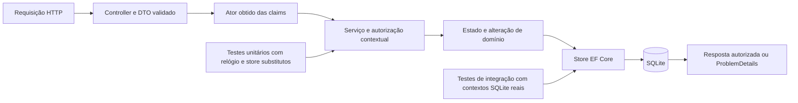
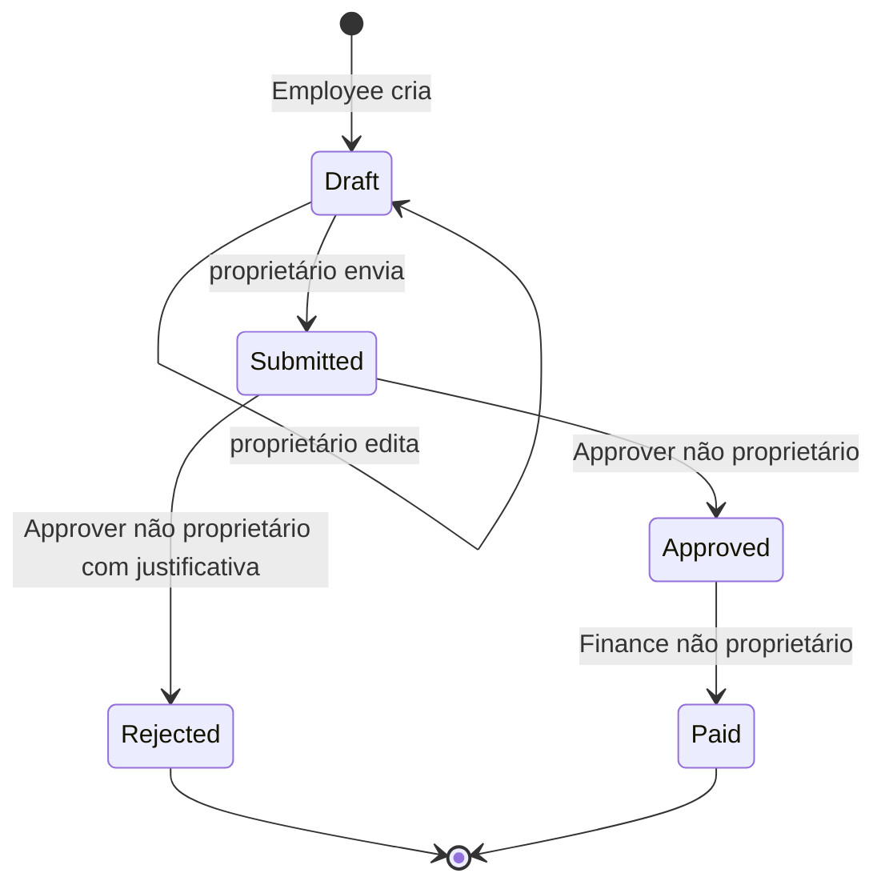

# Plano de implementação do ExpenseHub

Este plano transforma o checkpoint de C# em entregas verificáveis por issue. O objetivo é implementar a API inteira, demonstrar autorização e alcançar score 100 no pipeline oficial, com documentação interativa e demonstração HTTP automatizada. Público: integrantes do grupo. As decisões técnicas e os extras são propostas do grupo, identificadas separadamente das exigências do professor. Plano revisado em 03/10/2026; execução iniciada. A fundação relacional está implementada e validada localmente; o [registro de execução](EXECUCAO.md) distingue resultados reais das entregas ainda previstas.

A prioridade escolhida pelo usuário é **API com documentação interativa e demonstração automatizada**. O escopo adicional inclui Scalar, provas de persistência/concorrência e relatórios reproduzíveis. O contrato das 13 rotas obrigatórias continua sendo a base da entrega.

A execução por integrante está detalhada na [divisão de trabalho e autoria](DIVISAO-TRABALHO.md): oito pacotes e 40 unidades de esforço estimadas para cada aluno, com arquivos, dependências, critérios de aceite, exemplos de commits e revisão cruzada.

| Integrante | RM |
|---|---|
| João Marcelo Furtado Romero | RM555199 |
| Matheus Rivera Montovaneli | RM555499 |
| André Nakamatsu Rocha | RM555004 |

## Especificação e estado inicial

A referência inspecionada é o [template original](https://github.com/Racass/checkpoint-csharpracass-expensehub/tree/58c8405387f5e9ae9725ad964917e7634a870b74), SHA `58c8405387f5e9ae9725ad964917e7634a870b74`. Foram consultados README, enunciado, requisitos, matriz, rubrica, processo GitHub, uso de IA, as dez issues, analisadores, workflow, script de qualidade, schema e testes do corretor. Revalidar o backlog original antes de implementar cada issue.

- O repositório identifica a atividade como Checkpoint 2. A pasta local `cp5` não altera a especificação.
- Em 02/10 a pasta estava vazia e sem Git, e a inspeção ocorreu em cópia temporária. Em 03/10 foi criado o [repositório público do grupo](https://github.com/gh-johnny/checkpoint-expensehub-fiap) por template, com SHA base `8f4dac931306f061ba2a3c4aeac1ceac5d520b9e`.
- O template contém API `net10.0`, MSTest 4.0.2, `/health` e OpenAPI. Domínio, persistência, Identity e testes funcionais ainda precisam ser implementados.
- A base de conhecimento contém somente seu README; nenhum fato ou runbook aplicável foi encontrado.
- Entrega: **13/10/2026**, conforme o [enunciado](https://github.com/Racass/checkpoint-csharpracass-expensehub/blob/main/docs/ENUNCIADO.md). Horário não informado; proposta: concluir em 12/10.
- Cadastro do grupo: o anúncio informa encerramento em **30/09/2026**. O Forms responde por HTTP, mas não foi possível confirmar pela interface se aceita respostas. Nenhuma resposta foi enviada. Confirmar registro existente ou regularizar a situação com o professor.

### Ambiente e verificações realizadas

O SDK local `10.0.111` falhou no restore normal do template intacto com `NETSDK1226`: faltam os dados de pruning de `Microsoft.AspNetCore.App`; o diretório `PrunePackageData` não existe nessa instalação.

O diagnóstico temporário `-p:AllowMissingPrunePackageData=true`, sem editar arquivos do template, permitiu restore e build com **0 erros e 0 warnings**. A execução de testes abortou porque falta o runtime **Microsoft.AspNetCore.App 10**. Portanto, os testes não foram validados localmente e os comandos normais ainda não passam.

O [workflow oficial do mesmo SHA](https://github.com/Racass/checkpoint-csharpracass-expensehub/actions/runs/36162397495) terminou com sucesso. O artefato `code-quality-report`, ID `10876561860`, foi lido: score **100**, nenhum finding, SDK **10.0.401**, Gitleaks **8.30.1**. Esse resultado valida o ponto de partida, não as futuras funcionalidades.

Ação técnica realizada em 03/10: SDK 10.0.401 e runtime ASP.NET Core 10.0.12 instalados fora do repositório, junto de PowerShell 7.6.6 e Gitleaks 8.30.1. Os comandos normais passaram usando essa instalação no PATH da sessão. O diagnóstico antigo acima permanece como registro do ambiente inicial; a propriedade de workaround não entrou no projeto. Nenhuma configuração global de SDK/Git foi alterada.

## Critério de conclusão

Concluir somente quando as dez issues têm evidência válida, os 13 endpoints seguem o contrato, autorização e estados estão testados, a suíte unitária própria passa sem dependências externas e o relatório do SHA final mostra score 100, zero erros e zero warnings. Outra pessoa deve conseguir configurar, criar o banco, executar e validar a API pelo README.

A [rubrica](https://github.com/Racass/checkpoint-csharpracass-expensehub/blob/main/docs/RUBRICA.md) aplica os seguintes tetos à nota: **2,0** se não compila no ambiente oficial; **4,0** se autorização está sistematicamente ausente; **8,0** se faltam testes unitários significativos. Falha do template/ambiente oficial não gera esses gates. I10 vale **25%**; workflow verde não comprova score 100 nem funcionalidade correta.

## Decisões técnicas propostas

| Tema | Escolha e finalidade |
|---|---|
| Solução | Preservar API e UnitTests; acrescentar `ExpenseHub.IntegrationTests` para provas específicas do provider, separado dos unitários pontuáveis. Manter os três projetos na mesma solução. |
| HTTP | Controllers de despesas/administração, DTOs de entrada e DataAnnotations; regras contextuais nos serviços. |
| Autenticação | Identity com bearer nativo e mapeamento de `/register` e `/login`; demonstrar `useCookies=false`. Bearer não exige JWT. |
| Cadastro | Usuário novo sem roles; Admin atribui permissões pelo endpoint administrativo. |
| Persistência | SQLite com `IdentityDbContext` compartilhado pelo Identity e domínio, migrations versionadas. |
| Pacotes | SQLite, Design, Identity EntityFrameworkCore e ferramenta local `dotnet-ef` em **10.0.12**, alinhados ao OpenAPI do template. Essas versões foram verificadas no NuGet. |
| Configuração | Connection string e senha inicial em User Secrets/ambiente; arquivos versionados apenas com placeholders. |
| Tempo | `TimeProvider` injetado, auditoria UTC; proposta: validar data da despesa pela data UTC atual, documentando a convenção. |
| Erros | `ProblemDetails` consistente; nenhuma credencial ou detalhe interno em respostas inesperadas. |
| Testes | MSTest existente; ator explícito, relógio controlado e substitutos nas fronteiras de persistência/Identity. |
| Concorrência | `Revision` long gerenciada pela aplicação e configurada como concurrency token; pagamento único e histórico ordenado pela revisão. |
| Documentação interativa | OpenAPI nativo com Scalar.AspNetCore **2.17.13**, conferido no NuGet com target net10.0; interface `/docs` no ambiente Development. |
| Demonstração | PowerShell 7, já necessário ao corretor: requisições reais, assertivas, retorno de processo e relatórios JSON/Markdown. |

O [Identity nativo](https://learn.microsoft.com/en-us/aspnet/core/security/authentication/identity-api-authorization?view=aspnetcore-10.0) usa tokens próprios. Aproveitar esse mecanismo; não implementar criptografia ou emissor JWT adicional para esta POC.

O valor permanece `decimal`. SQLite tem [limitações para comparação/ordenação](https://learn.microsoft.com/en-us/ef/core/providers/sqlite/limitations) desse tipo; validar no domínio e evitar consultas monetárias não exigidas. Não usar `double` nem impor duas casas decimais: o contrato não define essa restrição.

```text
sources/
  ExpenseHub.slnx
  ExpenseHub.Api/
    Controllers/
    Contracts/Requests/
    Contracts/Responses/
    Models/
    Services/
    Persistence/
    Migrations/
  ExpenseHub.UnitTests/
    Expenses/
    Authorization/
    Administration/
    TestDoubles/
  ExpenseHub.IntegrationTests/
    Persistence/
    Concurrency/
```

Entradas têm validação declarativa coerente; saídas contêm somente dados autorizados. Não receber ou serializar entidades EF diretamente. Interfaces existem apenas nas fronteiras necessárias ao isolamento dos testes; evitar repository genérico, CQRS, MediatR e arquitetura distribuída.

## Modelo de dados proposto

| Entidade | Conteúdo necessário |
|---|---|
| `Expense` | ID gerado, OwnerId, descrição, Amount decimal, ExpenseDate, estado, categoria, `CreatedAtUtc` e `Revision` long. |
| `ExpenseCategory` | ID e nome; tabela relacional referenciada pela despesa. |
| `ExpenseHistory` | ID, despesa, revisão, ação, ator, UTC, estados anterior/posterior, justificativa e alterações de Draft com valores anteriores/novos. |
| `PaymentRecord` | ID, despesa com vínculo único, ator, UTC e valor derivado da despesa. |
| Identity | Usuário e roles nativos; nenhuma propriedade própria para senha persistida. |

A especificação exige `ExpenseCategory`, mas não define catálogo, rota de categorias ou campo obrigatório de categoria no payload. Proposta mínima: uma categoria `General`, criada idempotentemente como dado de domínio e atribuída pelo servidor. Uma despesa com apenas descrição, valor e data deve funcionar. Não implementar CRUD de categorias nem adicionar entrada obrigatória não documentada.

Payload proposto para criar/editar: `description`, `amount`, `expenseDate`. Registrar nomes e formatos no README/OpenAPI. Proposta: GUID para despesa/históricos; manter ID nativo do usuário Identity. Esses detalhes de schema não foram prescritos pelo enunciado.

Mapear FKs entre entidades e usuários. Cada despesa tem um único valor, sem coleção de itens. Criar histórico desde I04, sem esperar I08. Criação, alterações efetivas de Draft e transições válidas precisam de registros correspondentes. Estado, histórico e pagamento compartilham uma operação lógica de persistência no mesmo contexto.

## Desenho de execução

Os nomes abaixo descrevem arquivos previstos. Implementar apenas os tipos usados pelos fluxos; contratos novos precisam de consumidores e testes correspondentes.

| Arquivo ou componente previsto | Responsabilidade e limite |
|---|---|
| `Controllers/ExpensesController.cs` | Binding, autorização geral por role, chamada de serviço e resposta. Sem regra de negócio ou DbContext direto. |
| `Controllers/AdminUsersController.cs` | Operações administrativas com entrada/saída explícitas. |
| `Services/ExpenseService.cs` | Orquestrar criação, edição, consulta e transições; uma unidade de persistência por alteração. |
| `Services/ExpenseAuthorization.cs` | Permissão por ação e escopo de leitura derivados de role/ownership. Usado também pelo serviço, mesmo sem controller. |
| `Services/CurrentActor.cs` | Snapshot imutável de UserId e roles obtidos das claims; construído no limite HTTP e passado ao serviço. |
| `Models/Expense.cs` | Estado e revisão com setters restritos; transições válidas e valores persistidos. |
| `Services/IExpenseStore.cs` | Fronteira específica para carregar, consultar dentro de escopo, adicionar e persistir despesas. Sem abstração genérica de entidades. |
| `Persistence/EfExpenseStore.cs` | EF Core, filtros SQL, tracking nas alterações, projeções nas leituras e tradução de conflitos conhecidos. |
| `Services/UserRoleService.cs` | Roles conhecidas, proteção do próprio Admin e atualização completa do conjunto. |
| `Persistence/IdentityUserRoleStore.cs` | Adapter de UserManager/RoleManager e transação para substituição de roles. |
| `Persistence/IdentitySeed.cs` | Cinco roles e exatamente um Admin inicial, idempotentes; configuração segura. |
| `Contracts/Requests/ExpenseDraftRequest.cs` | Mesma entrada validada para POST e PUT de Draft; evitar duplicação de DTOs idênticos. |
| `Contracts/Requests/RejectExpenseRequest.cs` | Somente justificativa; nenhum ator ou estado do cliente. |
| `Contracts/Requests/UpdateUserRolesRequest.cs` | Lista de nomes validada; conjunto vazio permitido para outro usuário. |
| `Contracts/Responses/` | Despesa, usuário e histórico com campos autorizados, sem entidades EF ou credenciais. |
| `Infrastructure/ApiExceptionHandler.cs` | Falhas inesperadas com ProblemDetails e correlação; não transforma toda falha de banco em conflito. |
| `Documentation/BearerSecurityTransformer.cs` | Security scheme e metadados OpenAPI coerentes com o bearer do Identity. |

`CurrentActor` contém o UserId e um `IReadOnlySet<string>` de roles conhecidas. Os serviços recebem esse ator e CancellationToken; testes chamam os mesmos métodos com snapshots construídos no teste. Não precisam de um HttpContext artificial para exercitar ownership. Propagar cancelamento às APIs que aceitam CancellationToken, especialmente EF; não inventar parâmetros ausentes nos métodos do Identity.

O store deve separar carregamento para alteração de consulta visível. Sua implementação aplica o escopo autorizado no banco; consumidores não recebem IQueryable para montar consultas arbitrárias. A distinção mantém o 409 de repetição sem reaproveitar indevidamente o filtro de leitura.



### Mapeamentos e invariantes no banco

| Mapeamento proposto | Motivo e evidência |
|---|---|
| Expense.Id e IDs do histórico/pagamento como GUID | Geração no servidor; round-trip sem colisão no fixture. |
| Status como string conhecida, com check constraint dos cinco estados | Dados persistidos legíveis; impedir estado inexistente diretamente no banco. |
| Revision long, inicial 1, `IsConcurrencyToken()` | UPDATE considera a revisão originalmente lida; concorrência não sobrescreve silenciosamente. |
| Histórico único em `(ExpenseId, Revision)` | Uma entrada por alteração efetiva; ordem estável por revisão mesmo com timestamps iguais. |
| PaymentRecord.ExpenseId único | Segunda gravação de pagamento encontra proteção relacional adicional. |
| FK de proprietário, categoria e atores com comportamento restritivo apropriado | Sem histórico órfão ou apagado em cascata pelo domínio. Não modificar em bloco as relações nativas do Identity. |
| Índice `(OwnerId, ExpenseDate, Id)` | Apoiar consultas do proprietário com ordenação determinística. |
| Índice `(Status, ExpenseDate, Id)` | Apoiar filas de Approver/Finance e filtros de estado. |
| Histórico consultado por ExpenseId e ordenado por Revision | Linha do tempo reproduzível; sem ordenar ações pelo GUID aleatório. |
| DateOnly para data e DateTime UTC para eventos | Formato date no contrato e instante com UTC no histórico; conferir Kind UTC após materialização. |
| Amount decimal preservado pelo provider | Sem arredondamento para double ou conversão arbitrária para centavos; testar o máximo e round-trip decimal. |

Comprimento e limites monetários continuam validados na aplicação. Não presumir que `HasMaxLength` ou `HasPrecision` façam SQLite impor esses limites automaticamente. As migrations devem criar os índices, FKs e constraints realmente declarados e ser aplicadas aos fixtures de integração.

Usar os métodos Async exigidos pelo fluxo e analisadores. [Microsoft.Data.Sqlite tem limitações de async](https://learn.microsoft.com/en-us/dotnet/standard/data/sqlite/async); o nome Async não comprova I/O não bloqueante nesse provider. Relatórios podem registrar durações observadas, sem prometer throughput ou SLA sem medição.

## Contratos HTTP

A referência é [REQUISITOS.md](https://github.com/Racass/checkpoint-csharpracass-expensehub/blob/main/docs/REQUISITOS.md). Status de sucesso abaixo são propostas de documentação; os códigos de erro seguem o contrato oficial.

| Endpoint | Regra e sucesso proposto | Evidência central |
|---|---|---|
| `POST /register` | Público, sem roles do cliente; 200. | Tentativa de promoção não concede role; entrada inválida 400. |
| `POST /login` | Público, credencial válida gera bearer; 200. | Credencial inválida 401; token acessa rota protegida. |
| `GET /api/admin/users` | Somente Admin; 200. | Demais perfis 403; sem hashes/segredos no retorno. |
| `PUT /api/admin/users/{id}/roles` | Somente Admin, roles conhecidas; 204. | Usuário ausente 404; role inválida 400; própria remoção de Admin 403. |
| `POST /api/expenses` | Employee, servidor cria Draft próprio; 201. | Estado/proprietário enviados não controlam a entidade. |
| `PUT /api/expenses/{id}` | Employee, proprietário, Draft; 200. | Outro proprietário 403; estado incompatível 409. |
| `GET /api/expenses` | União da visibilidade das roles; 200. | Filtrar no banco antes de materializar. |
| `GET /api/expenses/{id}` | Recurso visível; 200. | Recurso ausente/invisível 404. |
| `POST /api/expenses/{id}/submit` | Employee, proprietário, Draft → Submitted; 200. | Outro proprietário 403; repetição 409. |
| `POST /api/expenses/{id}/approve` | Approver, não proprietário, Submitted → Approved; 200. | Autoaprovação 403; repetição 409. |
| `POST /api/expenses/{id}/reject` | Approver, não proprietário, Submitted → Rejected; 200. | Justificativa inválida 400; repetição 409. |
| `POST /api/expenses/{id}/pay` | Finance, não proprietário, Approved → Paid; 200. | Autopagamento 403; repetição 409; pagamento único. |
| `GET /api/expenses/{id}/history` | Mesma visibilidade da despesa; 200. | Invisível 404; histórico completo do recurso correto. |

Em rotas protegidas: anônimo/token inválido → 401; autenticado sem permissão da ação → 403. Na escrita, verificar role, existência, proibições contextuais e estado. Operação negada não altera dados nem produz histórico. A validação HTTP pode rejeitar corpo inválido antes de chamar o serviço.

Roles válidas: Admin, Employee, Approver, Finance e Auditor. A atualização administrativa substitui o conjunto por uma `List<string>` validada. Lista vazia pode remover todas as roles de outro usuário; não impor mínimo de uma role. Validar todos os nomes e a proteção do próprio Admin antes de remover qualquer vínculo. Após mudar roles, demonstrar novo login; tokens anteriores não evidenciam permissões novas.

## Autorização e estados

A [matriz oficial](https://github.com/Racass/checkpoint-csharpracass-expensehub/blob/main/docs/MATRIZ-AUTORIZACAO.md) precisa ser implementada e testada nos serviços, além dos atributos de controller.

| Role isolada | Visibilidade de despesas |
|---|---|
| Employee | Próprias, em qualquer estado. |
| Approver | Submitted. |
| Finance | Approved e Paid. |
| Auditor | Todas. |
| Admin | Nenhum acesso funcional implícito. |

Combinar essas condições por união e aplicar o predicado ao `IQueryable` antes de `ToListAsync`, consulta de detalhe e histórico. Não carregar tudo para filtrar em memória. Usar projeção e `AsNoTracking` nas leituras pertinentes.

Roles acumulam permissões: Admin + Employee pode criar despesas; Auditor + Employee pode exercer ações de Employee. Auditor não bloqueia globalmente permissões recebidas de outra role. Nenhuma combinação permite aprovar, reprovar ou pagar despesa própria.



Rejected e Paid são finais. Não implementar reabertura, reenvio de Rejected, cancelamento ou exclusão. Ação incompatível ou repetida retorna 409 sem registros extras.

**Leitura e mutação precisam de caminhos distintos.** Após aprovar/reprovar, Approver isolado perde a visibilidade de leitura. Reutilizar esse filtro na mutação transformaria uma repetição em 404, quebrando o contrato de 409. A mutação verifica a permissão da ação e seu estado; detalhe e histórico continuam protegidos pela visibilidade de leitura.

## Validação e atomicidade

| Regra | Casos a verificar |
|---|---|
| Descrição obrigatória, 10–500 caracteres | Ausente, vazia, espaços e comprimentos 9/10/500/501. Proposta: validar após remover espaços externos. |
| Valor decimal, 0,01–2.147.483.647 | Zero, negativo, 0,009, mínimo exato, intermediário, máximo exato e acima do máximo. |
| Data válida e não futura | JSON com data inválida, dia anterior/atual/seguinte com relógio fixo. |
| Justificativa de reprovação, 10–500 | Ausente, vazia, espaços, 9/10/500/501 e texto válido preservado. |
| Categoria do servidor | Payload mínimo válido gera FK real sem campo adicional obrigatório. |
| ID, proprietário, estado, ator, horário | Tentativas de informar esses campos não sobrescrevem valores do servidor. |

Combinar DataAnnotations com regras de serviço/domínio para relógio, ator, estado e recurso. Comparar valores em decimal; o máximo é monetário, não centavos ou conversão para int. Tratar cultura explicitamente quando necessário.

### Alteração completa e controle de concorrência

Para cada comando de escrita:

1. Validar entrada e obter o ator do limite HTTP.
2. Verificar role da ação, carregar entidade com tracking, negar propriedade proibida e validar estado atual.
3. Guardar snapshot anterior; obter um único instante UTC do TimeProvider.
4. Aplicar a alteração e incrementar Revision; gerar histórico com essa revisão e o mesmo ator/instante.
5. Em pagamento, montar também PaymentRecord com o valor da despesa.
6. Persistir a alteração completa por uma chamada a SaveChangesAsync; só devolver sucesso após confirmação.
7. Traduzir conflito de revisão para 409 e descartar o estado pendente da requisição. Próxima tentativa começa com leitura nova, sem retry cego da transição.

A criação inicia Revision 1. Proposta: PUT que não muda nenhum campo devolve 200 sem nova revisão/histórico, pois não houve alteração efetiva. Isso é decisão do grupo e precisa de teste; transições repetidas continuam sendo 409.

[EF Core permite concurrency tokens gerenciados pela aplicação](https://learn.microsoft.com/en-us/ef/core/saving/concurrency), apropriados ao SQLite. Uma violação de índice único pode produzir exceção específica do provider, diferente de DbUpdateConcurrencyException. Traduzir somente conflitos identificados do pagamento/histórico; FK inválida, corrupção ou outra falha não viram 409 automaticamente.

[SaveChanges agrupa alterações em transação quando o provider oferece esse suporte](https://learn.microsoft.com/en-us/ef/core/saving/transactions). Em administração, UserManager pode executar vários saves durante remoção/adição de roles: validar o conjunto completo primeiro e usar transação explícita do mesmo contexto. Uma falha não deve deixar apenas metade das roles solicitadas aplicada.

Teste determinístico de concorrência: dois contextos carregam a mesma despesa Submitted na revisão N; A aprova e persiste N+1; B tenta reprovar usando a leitura antiga. B falha; um terceiro contexto confirma uma decisão e uma entrada de histórico, sem sobrescrita. Essa montagem controla a leitura antiga e evita depender de timing de threads para produzir o conflito.

Unitários verificam decisões, composição da operação e origem de ator/tempo. Eles não comprovam a transação do provider. Demonstrar atomicidade relacional à parte: em banco descartável, provocar falha controlada na gravação do histórico/pagamento e confirmar estado anterior e ausência de registros parciais.

### Contrato de erro e correlação

ProblemDetails inclui os campos padrão e as extensões `code` e `traceId`. O cliente usa status/code; mensagens podem variar. Proposta de códigos estáveis: `request.invalid`, `auth.required`, `auth.forbidden`, `expense.not_found`, `expense.invalid_state`, `expense.concurrent_update`, `expense.invalid_description`, `expense.invalid_amount`, `expense.invalid_date`, `expense.invalid_reason`, `admin.invalid_role`, `admin.self_demotion` e `server.unexpected`.

```json
{
  "type": "urn:expensehub:problem:invalid-state",
  "title": "Operação indisponível no estado atual.",
  "status": 409,
  "instance": "/api/expenses/{id}/approve",
  "code": "expense.invalid_state",
  "traceId": "4bc741f516784f538d55197570537f31"
}
```

404 de recurso invisível e de recurso inexistente usam o mesmo formato e mensagem. A resposta de conflito não expõe proprietário ou detalhes fora da visibilidade. Validação de binding retorna ValidationProblemDetails com errors; 401/403 mantêm os headers necessários à autenticação e recebem corpo coerente quando aplicável.

Registrar logs estruturados com TraceId, ação, identificador do recurso, ator, resultado e duração. Não registrar senha, bearer ou corpo completo. O traceId liga uma falha da demo à requisição e ao log correspondente.

No [ASP.NET Core 10](https://learn.microsoft.com/en-us/aspnet/core/fundamentals/error-handling?view=aspnetcore-10.0), IExceptionHandler é singleton e handlers tratados podem ter diagnósticos suprimidos por padrão. Não injetar DbContext scoped nele. Configurar AddProblemDetails e UseExceptionHandler, escrever a resposta completa e registrar falhas inesperadas uma única vez. Regras esperadas são mapeadas no limite de aplicação, sem depender de uma exceção genérica de banco.

## Sequência das issues e evidências

I09 e I10 são transversais: toda PR já inclui testes relevantes, autorização revisada e qualidade verificada. I05 nasce com filtros corretos; I06 aprofunda a matriz. Histórico começa em I04; I08 fecha pagamento, consulta e atomicidade.

| Issue | Peso | Dependência oficial | Entrega e verificação |
|---|---:|---|---|
| [I01](https://github.com/Racass/checkpoint-csharpracass-expensehub/issues/1) | 4% | Nenhuma | Contexto, provider, entidades/FKs, migrations e documentação. Restore/build normais sem banco rodando; banco reproduzível. |
| [I02](https://github.com/Racass/checkpoint-csharpracass-expensehub/issues/2) | 9% | I01 | Identity, bearer, cinco roles e somente um Admin inicial. Seed repetido sem duplicação; senha segura; login válido/inválido; 401/403. |
| [I03](https://github.com/Racass/checkpoint-csharpracass-expensehub/issues/3) | 8% | I02 | Cadastro HTTP, listagem Admin e troca de roles. Atribuir/remover; impedir role arbitrária e própria remoção de Admin; usuário ausente e acessos negados. |
| [I04](https://github.com/Racass/checkpoint-csharpracass-expensehub/issues/4) | 7% | I01 e I03 | Criar/editar Draft com DTOs e histórico. Limites, mass assignment, outro proprietário e edição após envio. |
| [I05](https://github.com/Racass/checkpoint-csharpracass-expensehub/issues/5) | 7% | I04 | Enviar/listar/detalhar com filtro antes da materialização. Troca de IDs, ausente/invisível e envio repetido. |
| [I06](https://github.com/Racass/checkpoint-csharpracass-expensehub/issues/6) | 10% | I02 e I05 | Matriz de serviço completa, isolamento, perfis por estado, roles acumuladas, Admin/Auditor e autoaprovação/autopagamento. Testar 401/403/404. |
| [I07](https://github.com/Racass/checkpoint-csharpracass-expensehub/issues/7) | 12% | I06 | Aprovar/reprovar, justificativa, ator/UTC do servidor. Perfil errado, proprietário, estado inválido, repetição 409 e histórico único. |
| [I08](https://github.com/Racass/checkpoint-csharpracass-expensehub/issues/8) | 8% | I06 e I07 | Pagamento único, histórico autorizado, atomicidade. Fluxo completo, autopagamento, repetição e falha controlada de persistência. |
| [I09](https://github.com/Racass/checkpoint-csharpracass-expensehub/issues/9) | 10% | Transversal | Auditoria dos unitários de regras. Suíte independente de banco/rede e demonstração de defeitos simples detectados. |
| [I10](https://github.com/Racass/checkpoint-csharpracass-expensehub/issues/10) | 25% | Transversal | Score 100 no SHA final, zero warnings e sem segredos/artefatos. Ler relatório e registrar evidência na PR final, sem modificar controles. |

Para cada etapa: implementar → testar positivos/negativos → documentar → executar qualidade → revisar PR → merge. Endpoint existente não basta para concluir a issue.

### Testes unitários previstos

Manter MSTest e paralelismo por método; cada teste cria dependências próprias. Não usar EF InMemory, SQLite, rede ou serviços externos nos unitários pontuáveis.

| Grupo | Assertivas relevantes |
|---|---|
| Estados | Toda transição válida produz estado correto; inválidas/repetidas não alteram recursos. |
| Ownership/visibilidade | Outro Employee invisível; filtros de cada perfil; união de roles; Admin isolado sem acesso. |
| Decisões/pagamento | Proibições sobre recurso próprio prevalecem; perfil indevido não decide/paga. |
| Validações | Fronteiras textuais/monetárias, data controlada e justificativa persistida. |
| Histórico | Ação, ator, UTC, estados e mudanças de Draft; nenhum registro extra em falha/repetição. |
| Administração | Role inválida, conjunto vazio para outro usuário, proteção do próprio Admin e cadastro sem escalada. |
| Persistência lógica | Alteração e registros relacionados compõem operação única; falha não é relatada como sucesso. |

Não pontuam getters/mocks sem regra, testes do corretor, quantidade de métodos, cobertura percentual ou integração. Substitutos de persistência servem para exercitar regras reais; simplesmente verificar uma chamada de mock não basta.

Em cópia temporária, remover uma proteção de ownership, permitir transição repetida e relaxar limite de justificativa, um defeito por vez. Os testes correspondentes devem falhar. Descartar a cópia defeituosa; nenhuma mudança defeituosa entra no repositório final.

### Fluxo de referência para demonstração HTTP

Seed cria apenas o Admin. Por `/register`, criar dois Employees, Approver, Finance e Auditor; Admin atribui roles. Credenciais/tokens vêm do ambiente; exemplos usam e-mails fictícios, sem valores secretos literais no `.http`.

1. Login Admin → cadastro HTTP → roles → novo login de cada usuário.
2. Employee cria/edita Draft → envia → Approver aprova → Finance paga → Auditor consulta histórico.
3. Outra despesa → envio → reprovação com justificativa → estado final Rejected.
4. Troca de IDs, acessos anônimos, perfis indevidos, recursos invisíveis e conflitos.
5. Employee + Approver/Finance tentando agir sobre despesa própria: 403.
6. Admin isolado sem acesso funcional; Auditor isolado sem escrita; repetição e edição fora de Draft.
7. Reiniciar aplicação e repetir seed: dados persistidos e exatamente um Admin inicial.

## Extras escolhidos para a API

As próximas entregas adicionais são referência interativa, demo executável e provas do provider. Não são novas issues pontuadas e não garantem pontos além da rubrica; dão evidência e melhoram a apresentação do trabalho. Devem preservar os contratos obrigatórios e passar pelos mesmos controles de qualidade.

### Referência interativa com Scalar

Usar Microsoft.AspNetCore.OpenApi já presente e **Scalar.AspNetCore 2.17.13**, sem acrescentar outro gerador OpenAPI. A versão foi consultada no NuGet e contém biblioteca net10.0. Configurar `/openapi/v1.json` e `/docs` em Development, conforme o [guia oficial de integração](https://github.com/scalar/scalar/blob/main/documentation/integrations/aspnetcore/integration.md).

A referência deve permitir registrar/login, inserir o token retornado e executar as rotas protegidas. Não preconfigurar token ou senha no HTML. Desabilitar o recurso Agent do Scalar, pois essa entrega não depende de um serviço de IA na documentação.

O schema de segurança tem `type: http` e `scheme: bearer`, com nome documental `Bearer`. O scheme real do framework é `IdentityConstants.BearerScheme`, isto é, [Identity.Bearer](https://github.com/dotnet/aspnetcore/blob/main/src/Identity/Core/src/IdentityConstants.cs); não assumir o nome de um handler JWT. Não declarar formato JWT para tokens nativos do Identity.

Usar transformers do [OpenAPI nativo](https://learn.microsoft.com/en-us/aspnet/core/fundamentals/openapi/customize-openapi?view=aspnetcore-10.0) para declarar segurança por operação: register/login permanecem públicos; operações protegidas exigem bearer. A documentação descreve a matriz contextual, mas não executa autorização em lugar do serviço.

| Metadado de documentação | Evidência exigida |
|---|---|
| Tags Identity, Admin, Expenses e History | Cada operação obrigatória encontra-se na área correta. |
| OperationId único e estável | Geradores/clientes distinguem operações sem depender do texto da descrição. |
| Entrada e saída | DTOs mostram apenas campos aceitos; owner/status/ator/tempo não são campos editáveis. |
| Formatos e limites | DateOnly como date; valor como número decimal documentado; descrição e justificativa com limites. |
| Estados | Respostas apresentam nomes Draft/Submitted/Approved/Rejected/Paid, sem números mágicos. |
| Respostas | Sucesso e erros relevantes 400/401/403/404/409 com schemas consistentes. |
| Exemplos | Casos válidos e inválidos sem credenciais preenchidas; demonstração de como obter bearer pelo login. |
| Identidade | Login/registro públicos; novo login após roles e conta inicial única explicados. |

A demo busca o documento e confere presença das 13 rotas/métodos, OperationIds e definições de segurança. A interface visual é conferida manualmente no navegador: carregar schemas, executar login e uma rota protegida. HTTP 200 do HTML não comprova sozinho que a interface funciona.

### Demonstração automatizada

Arquivo previsto: `scripts/Invoke-ExpenseHubDemo.ps1`. PowerShell 7 já é requisito para reproduzir o corretor. Parâmetros mínimos: BaseUrl e diretório de relatório; email/senha Admin vêm de variáveis de ambiente, nunca de flags literais ou arquivos de credenciais.

O script opera contra uma API de demonstração com banco descartável próprio. Usuários adicionais são criados por HTTP, com emails fictícios e senhas geradas em memória; somente o Admin continua no seed. Capturar tokens por identidade e não imprimi-los. Gerar um identificador de execução para evitar colisão entre cadastros de duas rodadas.

| Cenário automatizado | Assertivas além do status |
|---|---|
| Bootstrap HTTP | Admin autentica, demais usuários são registrados e recebem roles; cada um faz novo login. |
| Cadastro com tentativa de escalada | Role enviada pelo cliente não aparece no conjunto concedido. |
| Draft válido | Owner vem do token, estado é Draft, valor/data/descrição retornam coerentes e criação gera histórico. |
| Edição de Draft | Campos mudam; histórico identifica valores anteriores/novos e ator. |
| Fluxo Approved/Paid | Envio, aprovação e pagamento produzem os estados e registros corretos; valor pago vem da despesa. |
| Fluxo Rejected | Justificativa preservada, estado final e proibição de reenvio. |
| Isolamento e roles | Segundo Employee não vê o recurso; Admin/Auditor isolados e perfis acumulados respeitam a matriz. |
| Autoaprovação e autopagamento | Operação 403; dono, estado e histórico ficam intactos. |
| Repetição | Mesmo submit/approve/reject/pay retorna 409; proprietário/Auditor confirmam ausência de histórico extra. |
| Entradas inválidas | Fronteiras de descrição, valor, data e justificativa retornam 400 sem persistência. |
| Bearer | Sem token ou token inválido retorna 401; role insuficiente retorna 403. |
| Documento OpenAPI | Métodos/rotas obrigatórios e security scheme corretos, sem exigir bearer em register/login. |

Ao aprovar/reprovar, conferir o resultado pelo proprietário ou Auditor, pois o Approver isolado pode perder a visibilidade. Repetição é verificada na rota de ação, onde deve produzir 409.

Cada cenário inclui nome, resultado esperado, observado, duração e traceId quando existente. Relatórios previstos: `artifacts/demo/report.json` e `artifacts/demo/report.md`, com SHA, horário UTC e resumo de cenários. Não incluir payloads secretos ou headers Authorization. Encerrar com código 0 somente quando todas as assertivas obrigatórias passam; divergência devolve código diferente de zero.

Não basta executar requisições e imprimir respostas. Cada cenário verifica status e invariantes relevantes. Erro de conectividade/readiness faz a demo falhar explicitamente, sem marcar cenários não executados como aprovados.

### Provas de persistência em projeto separado

Adicionar `ExpenseHub.IntegrationTests` à solução, mantendo o UnitTests original completamente independente de banco. Usar MSTest 4.0.2 e a mesma baseline de análise. Fixtures criam bancos SQLite descartáveis, aplicam migrations e possuem contextos próprios; não dependem de servidor ou de banco compartilhado da máquina.

| Prova | Arranjo e resultado verificável |
|---|---|
| Migrations e seed | Banco vazio recebe schema; seed roda duas vezes; um Admin inicial, cinco roles e nenhuma duplicação. Credenciais de fixture geradas em memória. |
| Round-trip e FK | Persistir/ler decimal no limite, DateOnly e UTC; impedir relação inexistente no banco. |
| Pagamento único | Segundo PaymentRecord para a mesma despesa encontra constraint; nenhum pagamento extra fica persistido. |
| Conflito de decisão | Dois contextos leem N; primeiro persiste N+1; escrita desatualizada falha sem segunda decisão/histórico. |
| Falha na gravação do histórico | Trigger de teste provoca abort de INSERT; estado e demais inserts da transação não permanecem. |
| Falha no pagamento | Falha controlada no insert demonstra rollback de estado, histórico e pagamento. |
| Substituição de roles | Falha controlada durante mudança conserva o conjunto original após rollback. |

Injeções de falha ficam somente no fixture de teste, sem endpoint ou modo público de falha na API. Confirmar estado final por um contexto novo, não apenas pelos objetos em tracking. Nomear esses testes como integração; não apresentá-los como unitários pontuáveis de I09.

O workflow original descobre projetos adicionais em sources e também os analisará. O projeto novo precisa executar com recursos locais descartáveis, sem requisito de serviço externo. Descartar conexões/arquivos no fim de cada fixture e preservar o isolamento do paralelismo.

### Evidência automática no GitHub

Workflow adicional previsto: `.github/workflows/demo.yml`, independente de `build.yml` do professor. Executar por workflow_dispatch e pull_request no repositório do grupo, com permissões mínimas de leitura do código.

1. Restaurar ferramentas/dependências e compilar a solução.
2. Preparar caminho SQLite exclusivo no diretório temporário do runner e credencial Admin gerada para a execução.
3. Aplicar migrations e iniciar a API em Development, sem servidor de banco externo.
4. Aguardar readiness com prazo definido; o /health indica que o processo iniciou, não que o fluxo está correto.
5. Executar Invoke-ExpenseHubDemo e respeitar seu exit code.
6. Publicar `expensehub-demo-report`, inclusive quando falha, com dados sanitizados.
7. Encerrar apenas o processo criado pelo próprio job e liberar recursos em finally; não usar encerramento global de processos dotnet.

Gerar a credencial em memória no runner e mascará-la antes de qualquer saída. Não exigir GitHub Secrets permanentes para esse banco descartável. O workflow adicional não altera o score do corretor e não substitui a execução oficial de code-quality.

### Extensões posteriores de consulta

Se Scalar, demo e provas já estiverem concluídos e todos os critérios obrigatórios estiverem verdes, considerar filtros opcionais `status`, `from` e `to` em GET /api/expenses, preservando o formato e comportamento da chamada sem parâmetros. O filtro adicional sempre intersecta a visibilidade autorizada; não permite consultar um estado invisível ao perfil.

Paginação pode ficar em uma rota adicional `GET /api/expenses/page`, com page inicial 1, pageSize padrão 20 e máximo 100, ordenação ExpenseDate/Id e totalCount do conjunto autorizado. CountAsync é correto quando a contagem é realmente o resultado desejado. Não mudar silenciosamente a listagem obrigatória para um envelope paginado. Essas extensões são condicionais e ficam fora do compromisso principal de documentação/demo.

## Pipeline e coleções

As [regras oficiais](https://github.com/Racass/checkpoint-csharpracass-expensehub/blob/main/docs/code-quality-rules.md) e o script real permanecem ativos no mesmo escopo.

| Controle | Prática necessária |
|---|---|
| FIAP1001 | Não rastrear bin/obj/.vs, DLL/EXE/PDB ou estado local; ignorar banco SQLite/WAL/SHM. |
| FIAP1002 e Gitleaks | Segredos fora do Git e histórico; User Secrets/ambiente, exemplos com placeholders. |
| FIAP2002–2006 | README e ignore; net10.0; sem WeatherForecast ou dados de execução versionados. |
| FIAP2101/2102 | Senha no Identity; nenhum arquivo de segredo dentro da árvore de análise. Mesmo ignorado pode gerar finding local. |
| FIAP3001 e CA1828 | AnyAsync para existência, sem CountAsync > 0. |
| FIAP3002/3003 e CA1849 | Async, sem Thread.Sleep ou consultas síncronas ao banco. |
| FIAP3004/3005 | DTO de entrada validado e mapeamento explícito, sem entidade recebida por controller. |
| CA1851/CA1860 | Não enumerar repetidamente; Count/Length quando já disponíveis. |
| CA1305/CA2000/CA2016/CA2208 | Cultura quando necessária, descarte, CancellationToken propagado e parâmetro correto em exceções. |
| IDE, SA1122 e CS1591 | Estilo da baseline, chaves, using, readonly, nomes, string.Empty e XML dos membros públicos exigidos. |
| FIAP4001 | Todos os testes passam; falha pode deixar workflow verde com score menor. |
| FIAP0096/0097 | Falha operacional do Gitleaks bloqueia CI; análise sem a ferramenta não equivale à validação completa. |

Não existe proibição geral de arrays: o template usa `string[] args` e possui score 100. Proposta por contexto: `List<T>` para construção/roles; `ICollection<T>` com backing List para navegações EF necessárias; `IReadOnlyList<T>` para resultados de leitura; arrays para estruturas fixas apropriadas. Diagnóstico real e semântica orientam a escolha; no JSON todas essas coleções aparecem como arrays.

Warnings CS podem consumir os 20 pontos da categoria Build; IDE desconta 1 por ID, CA geralmente 2 e CA de segurança 4. Cada ID desconta uma vez na categoria. Segredo impõe teto 9; restore/build falho ou arquivo proibido impõe teto 59 no score. Esses tetos diferem dos gates acadêmicos.

Não remover etapas, reduzir severidades, suprimir diagnóstico sem corrigir causa, marcar código escrito como gerado ou excluir código do escopo para elevar nota. Alterações legítimas de higiene, como ignorar banco local, precisam de justificativa na PR.

### Comandos e relatório final

Depois de corrigir o ambiente, executar na raiz do repositório:

```shell
dotnet restore ./sources/ExpenseHub.slnx
dotnet build ./sources/ExpenseHub.slnx --no-restore
dotnet test ./sources/ExpenseHub.slnx --no-restore
dotnet format ./sources/ExpenseHub.slnx --verify-no-changes --no-restore --severity warn
pwsh -NoProfile -File ./tests/Invoke-CodeQuality.Unit.Tests.ps1
pwsh -NoProfile -File ./tests/Invoke-CodeQuality.E2E.ps1
pwsh -NoProfile -File ./scripts/Invoke-CodeQuality.ps1 -Ci
```

O corretor também percorre cada `.csproj`; conferir resultados por projeto. Ler `artifacts/code-quality/report.json`: schemaVersion 2.0; repository.commit igual ao SHA entregue; status passed; score.final 100; capsApplied vazio; zero erros, warnings e bloqueantes. Registrar na PR final link do workflow, score e SHA. Relatórios ficam no artefato do Actions, sem commitar arquivos gerados.

Uma execução de PR pode analisar um merge temporário. A entrega deve apontar à `main` e seu relatório correspondente, após o merge final.

## Git e participação

O [processo GitHub](https://github.com/Racass/checkpoint-csharpracass-expensehub/blob/main/docs/PROCESSO-GITHUB.md) exige repositório público criado por template, mais de um commit por integrante e evolução real. Commits artificiais ou feitos por outra pessoa não geram crédito; [USO-DE-IA.md](https://github.com/Racass/checkpoint-csharpracass-expensehub/blob/main/docs/USO-DE-IA.md) inclui falsificação de autoria/histórico entre os usos inadequados.

Foi testado apenas `git -c user.name=... -c user.email=... var GIT_AUTHOR_IDENT`: os três perfis informados foram reconhecidos. Não foram criados commits ou alteradas configurações persistentes. O vínculo dos e-mails com contas GitHub não foi confirmado; consultar a [atribuição por e-mail](https://docs.github.com/en/account-and-profile/how-tos/email-preferences/setting-your-commit-email-address).

Autoria do commit e autenticação do push são diferentes. Nome/e-mail não autenticam outra conta nem comprovam participação. Cada integrante precisa produzir/revisar sua contribuição e registrar os próprios commits. Se o trabalho for efetivamente individual, alinhar o formato com o professor.

1. Criar repositório público por **Use this template**, sem fork; clonar a cópia do grupo e incorporar este plano.
2. Adicionar colaboradores. Handles informados: gh-johnny e imneli; o handle GitHub de André ainda não foi fornecido. Confirmar e-mails nas contas.
3. Executar workflow original; preservar controles. Verificar adequação do CODEOWNERS herdado ao acesso no novo repositório.
4. Branches: `i01-foundation-ef`, `i02-identity-auth`, `i03-user-roles`, `i04-expense-draft`, `i05-submit-query`, `i06-ownership-access`, `i07-approve-reject`, `i08-payment-history`, `i09-unit-tests`, `i10-code-quality`.
5. PR por issue no repositório do grupo, com referência `Racass/checkpoint-csharpracass-expensehub#N`, decisões, testes e evidências. Não fechar automaticamente as issues originais.
6. Commits coesos, auto-revisão, qualidade e merge preservando os commits individuais; evitar squash geral que elimine contribuições.
7. Conferir pelo menos dois commits reais por integrante na main, URL pública, acesso do professor e SHA exato de entrega.

A [divisão detalhada](DIVISAO-TRABALHO.md) distribui 24 pacotes, oito e 40 unidades de esforço por integrante. João conduz fundação, Identity, envio, infraestrutura de erro e CI; Matheus conduz roles, Draft, consultas/histórico e Scalar; André conduz domínio, autorização, decisões/pagamento e demo HTTP. Os três implementam testes unitários, provas SQLite, documentação e validação final, com revisão cruzada.

Cada aluno registra os próprios commits, sem trailers `Co-authored-by`, conforme solicitado. O plano prevê oito marcos de evolução por pessoa, sem transformar a contagem em quota ou fragmentar mudanças artificialmente. Na entrega, conferir pelo menos dois commits reais por integrante na `main`, associação dos três e-mails às contas GitHub e preservação da autoria nos merges. Nomes, RMs, e-mails informados e o login pendente de André constam no documento de divisão.

## Cronograma proposto

| Data | Marco | Condição para avançar |
|---|---|---|
| 02/10 | Planejamento técnico inicial | Plano escrito; marco de planejamento, sem execução do ambiente/repositório. |
| 03–04/10 | Preparação e I01–I03 | Registro do grupo verificado; repositório e três colaboradores; SDK/runtime completos; banco reproduzível, seed idempotente, bearer e administração. |
| 05–06/10 | I04–I06 | Rascunhos/envio, filtro SQL e matriz com casos negativos. |
| 07–08/10 | I07–I08 | Approved/Paid e Rejected, histórico, pagamento único e atomicidade. |
| 09–10/10 | Fechamento I09, Scalar, demo e provas SQLite | Unitários isolados detectam defeitos; documentação executável; demonstração e integrações passam. |
| 11–12/10 | Fechamento I10 e entrega | Clone limpo, score 100, zero warnings, relatórios oficiais/demo do SHA final e participação conferida. |
| 13/10 | Entrega | Enviar URL e SHA previamente validados. |

A prioridade escolhida é API/documentação/demo; frontend permanece fora da execução planejada. A rubrica permite recuperação funcional com frontend, mas essa possibilidade não altera os pesos nem os gates. Priorizar as dez issues e os extras selecionados. Deploy, Docker, anexos, integração bancária, itens múltiplos, notificações e novos estados permanecem fora do escopo.

### Regra objetiva para fechar escopo

Nenhum extra altera uma rota obrigatória sem preservar seu contrato. Cada entrega adicional precisa de evidência, documentação e zero novos warnings. Se o núcleo não estiver completo em 08/10, reprogramar os extras e manter 11–12/10 reservados à correção e validação. Filtros/paginação não entram antes de Scalar, demo, integrações e critérios obrigatórios concluídos. Não usar feature flags para ocultar código do corretor.

## Checklist final

- [ ] Cadastro do grupo confirmado ou regularizado com o professor.
- [ ] Repositório público por template, colaboradores e professor com acesso.
- [ ] Nome completo e RM dos três integrantes no cabeçalho da entrega/README.
- [ ] Mais de um commit real por integrante preservado na main.
- [ ] Pacotes de João, Matheus e André concluídos/revistos conforme a divisão de trabalho.
- [ ] Três e-mails de autoria associados aos perfis corretos, sem trailers Co-authored-by ou autoria de IA.
- [ ] Dez issues com PR/evidência correspondente.
- [ ] SDK/runtime documentados; restore/build/test normais em clone limpo.
- [ ] Banco persistente e criado por procedimento reproduzível.
- [ ] Seed somente de um Admin inicial, idempotente e sem credenciais versionadas.
- [ ] Cadastro, bearer, roles e novo login demonstrados.
- [ ] Todos os 13 endpoints com positivos, negativos e códigos HTTP corretos.
- [ ] Roles acumuladas, ownership, estados, Admin/Auditor e isolamento verificados.
- [ ] Histórico completo, pagamento único e falhas sem gravação parcial.
- [ ] Unitários próprios significativos, sem banco/rede, detectando regressões.
- [ ] Controles e testes do corretor preservados e executados.
- [ ] Score 100, zero erros/warnings e sem findings bloqueantes no SHA final.
- [ ] README com provider, setup, migrations, configuração, payloads e comandos.
- [ ] Arquivo HTTP utilizável sem senha/token literal.
- [ ] Scalar funciona no navegador com login e chamada autenticada; schema OpenAPI confere as 13 rotas.
- [ ] Bearer do Identity documentado corretamente, com register/login públicos e sem tokens preenchidos.
- [ ] Demo HTTP automatizada passa e falha quando uma assertiva obrigatória diverge.
- [ ] Provas SQLite demonstram concorrência, unicidade e rollback sem dependências externas.
- [ ] Relatórios da demo identificam SHA/cenários sem expor credenciais.
- [ ] Workflow adicional de demo executado sem modificar o workflow oficial.
- [ ] URL pública, SHA exato e links dos workflows registrados na entrega.
